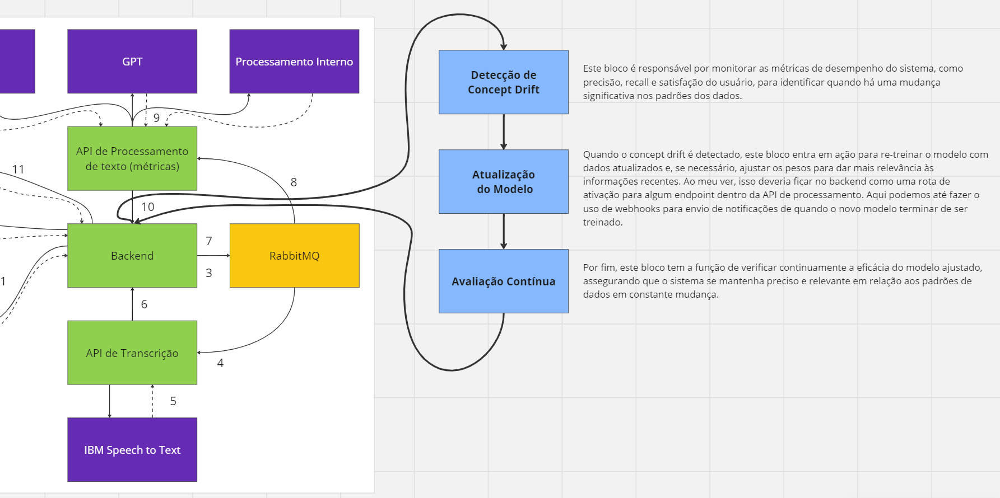

# Ponderada de programação - Luiz Covas

## Introdução
O fenômeno conhecido como concept drift ocorre em Machine Learning quando os modelos perdem acurácia devido a alterações nos padrões dos dados, influenciados por fatores externos. Por exemplo, as mudanças econômicas podem alterar o comportamento dos usuários e afetar as predições dos modelos. Para abordar este desafio, é crucial não apenas ajustar o modelo (por meio de re-treinamento, uso de pesos, etc.) mas também detectar essa mudança de forma proativa.

## Solução proposta
Desenvolver estratégias eficazes de adaptação às mudanças nos padrões de dados e nas preferências dos usuários é essencial. Conforme destacado no artigo de Erica Bertan, o primeiro passo é detectar a ocorrência de um concept drift. Para isso, ferramentas de monitoramento devem ser implementadas para acompanhar a performance do sistema conversacional, utilizando métricas como precisão, recall e satisfação do usuário, para identificar quando o sistema não está cumprindo as expectativas.

Quando as métricas de avaliação do modelo caem abaixo de um nível aceitável, é necessário re-treinar o modelo com novos inputs dos usuários e, se possível, com dados de um dataset mais atualizado, refletindo as informações mais recentes. Além disso, ajustar os pesos para dar mais importância às informações recentes pode ser uma estratégia eficiente para mitigar o concept drift.

Figura 1: Fluxo que poderia sem implementado em nosso projeto 

## Conclusão
Resumindo, a gestão do concept drift em sistemas de Machine Learning exige uma abordagem dinâmica e proativa. Monitorar continuamente o desempenho do sistema, detectar mudanças de padrão de forma eficiente e ajustar o modelo adequadamente são etapas cruciais para manter a acurácia e a relevância do sistema. Por meio dessas estratégias, é possível assegurar que o sistema conversacional se adapte às mudanças contínuas no ambiente e nas preferências dos usuários, mantendo sua eficácia e precisão ao longo do tempo.

### Referências bibliógraficas
- Bertan, Erica. "O que é concept drift em Machine Learning?" Medium.
- Barbosa, Eduardo Victor Lima; de Almeida, Paulo Ricardo Lisboa. "Challenges on Classifying Data Streams with Concept Drift." In: Workshop de Teses e Dissertações (WTDBD) - Simpósio Brasileiro de Banco de Dados (SBBD), 2022, Búzios. Anais, Sociedade Brasileira de Computação, 2022, p. 126-132. DOI: 10.5753/sbbd_estendido.2022.21854.
